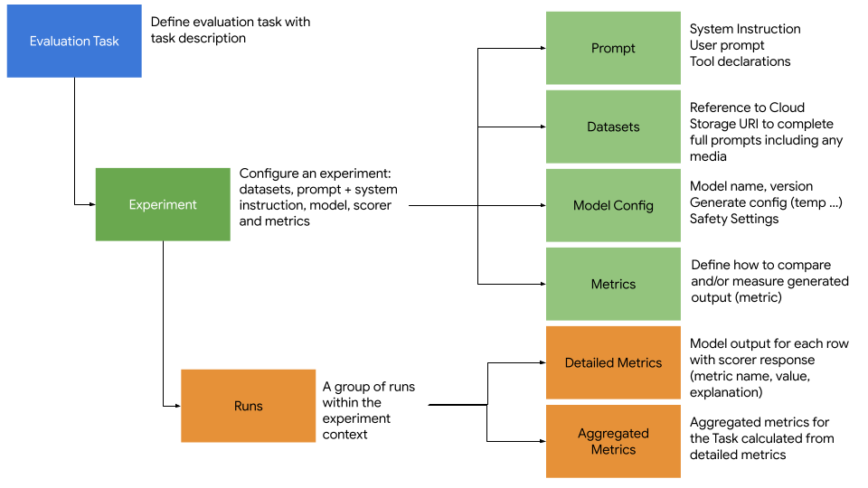

# Data Schema for Vertex AI Gemini Evaluation Playbook

The playbook leverages BigQuery to define experiments, store configuration and result data, enabling seamless integration with data analysis and visualization tools. This page explains the data schema setup in BigQuery providing a structured approach to model evaluation.

## Tables

### Tables for managing configuration

- **Tasks `eval_tasks`**: Defines high-level information about each task the model will be evaluated on, including its description, creation and update timestamps, tags, and metadata.

- **Experiments `eval_experiments`**: Define an experiment with description, associated task, reference to evaluation dataset and prompt, including model information, generation configuration, safety settings, metric configuration, and other metadata.

- **Prompts `eval_prompts`**: Manage prompt templates, including system instructions, multimodal content, tools or tool config, and associated metadata.

- **Datasets `eval_datasets` *(not used)***: Tracks evaluation datasets, capturing their descriptions, formats, locations, and reference column names.

### Tables for logging evaluation runs

- **Evaluation Runs `eval_runs`**: Log individual evaluation runs for each experiment with aggregated evaluation metrics, elapsed time, and other relevant details.

- **Evaluation Run Details `eval_run_details`**: Log each run at detail level including full input prompt and output text for each example with evaluation metric and other relevant details.

> [!NOTE]
> This set up also allows for repeated runs of the same configuration to establish repeatability, reproducibility and robustness of the models.

By carefully designing your experiments and populating these tables, you can create a comprehensive record of your evaluation efforts, facilitating in-depth analysis and informed decision-making.